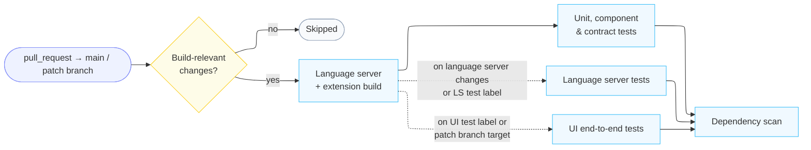
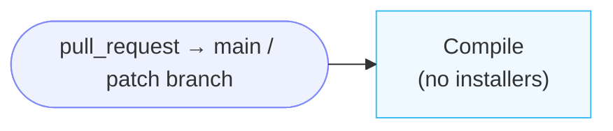
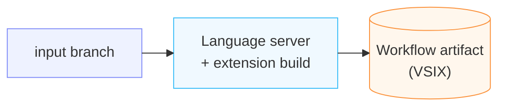
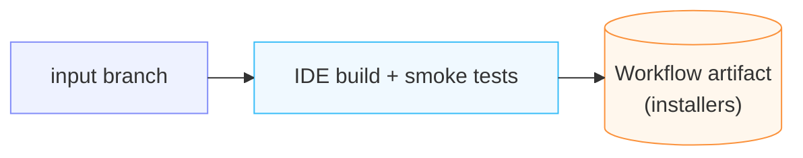
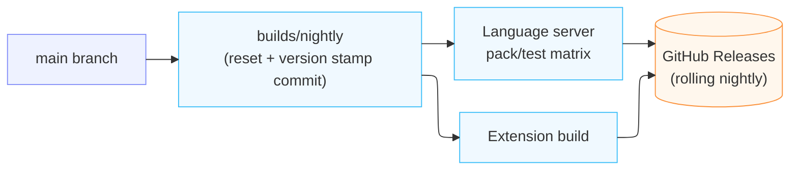
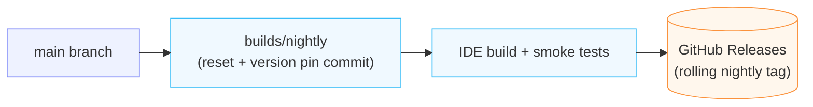
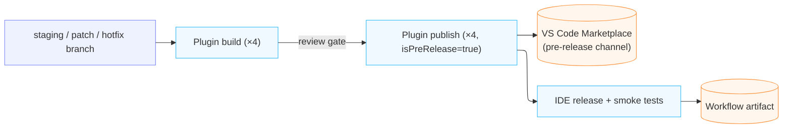
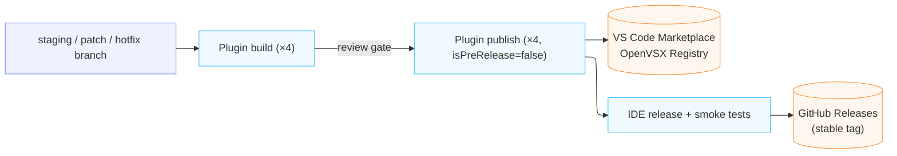

# CI/CD Pipelines

_Authors_: @NipunaRanasinghe \
_Reviewers_: @keizer619, @anupama-pathirage, @samithkavishke \
_Created_: 2026/08/10 \
_Updated_: 2026/08/12

This document describes the four GitHub Actions pipeline types used across all WSO2 Integrator repos:

- **PR pipelines:** run on pull requests to active branches; the configured gates must pass before merge. The stages differ per repo.
- **Custom build pipeline:** builds an IDE pack (or, in a plugin repo, a VSIX) on demand from any given branch.
- **Nightly pipeline:** runs daily. Each repo builds its own nightly from `main` and publishes it for downstream repos to consume.
- **Stable / GA pipeline:** a single three-stage pipeline (plugin build → plugin publish → IDE release) for both pre-release and GA releases; the `isPreRelease` flag controls the Marketplace channel and IDE artifact destination.

## Pull Request Pipelines

PR pipelines run on pull requests targeting active branches and must pass before a merge is permitted. The stages are not uniform across the two repo types.

**Product tooling repos** build the full chain and scan dependencies. Change detection runs first, so a pull request touching nothing build-relevant skips the build entirely.

The heavier suites are selective rather than unconditional, and each has its own trigger:

- **Unit, component, and contract tests** run with every build.
- **Language server tests** run when language server paths changed, or when the pull request carries the `Checks/Run LS Tests` label.
- **UI end-to-end tests** run when the pull request carries the `Checks/Run Ballerina UI Tests` label, or when it targets a patch branch.

**Product distribution repo** compiles the WSO2 Integrator extension, without building installers.

## Custom IDE Build Pipeline

Triggered manually to build from the branch it is dispatched on, for testing unmerged changes or a feature that spans multiple repos. In both repo types, versions are timestamped for that run only, nothing is committed to any branch, and nothing is published to GitHub Releases or the Marketplace — the result is a workflow artifact.

**Product tooling repos** build the dispatched branch into a timestamped pre-release VSIX.

**Product distribution repo** builds a complete IDE pack from the dispatched branch.

This build does not trigger builds in the plugin repos. Inputs select whether the Ballerina and MI extensions are taken from their pinned builds or from the Marketplace, and every other component comes from the pinned component versions. To include unmerged plugin changes, first run the plugin repo's custom build to produce a VSIX, then supply it to this build.

## Nightly Pipeline

Runs automatically on a daily schedule (06:30 UTC). Each repo runs its own nightly independently. The product distribution repo does not trigger plugin builds — it pins whatever nightly artifacts the plugin repos have already published.

Nightlies build from `main`, and switch to the release staging branch for as long as one exists, so that during a release window the nightly exercises the branch the release will be cut from. See [Branching Strategy](branching-strategy.md#release-staging-branch-stagingrelease-version).

Both repo types follow the same shape: reset a dedicated `builds/nightly` branch from the source branch, commit the versions for that night onto it, and build that commit. The diff between the source branch and the build branch is therefore exactly the version commit, so every nightly is reproducible from a single commit.

**Product tooling repos** stamp a timestamped pre-release version, then build and test from that commit.

The rolling `nightly` release is replaced only after every validation job passes. The language server matrix is where Windows coverage runs; the pull request build does not cover it.

**Product distribution repo** pins each component to the newest nightly published upstream, then builds the IDE from that pinned commit.

**Stage 1 — Pin the component versions:** Every dependent component is pinned to the newest nightly its upstream repo publishes, falling back to that repo's newest GA release when it publishes no nightly. The product and extension versions are stamped alongside those pins in the same commit.

**Stage 2 — IDE build:** That commit is built for Linux, macOS, and Windows, smoke tests run, and on success the rolling `nightly` GitHub Release is replaced. The build branch (`builds/nightly`) and the published tag (`nightly`) are named differently on purpose: the tag is what external consumers pin their download URLs to, and using one name for both would leave the ref ambiguous.

## Release Pipelines

The Stable / GA pipeline runs all three stages for both pre-releases (alpha, beta, RC) and GA releases. The `isPreRelease` flag controls the Marketplace channel and the IDE artifact destination.

**Pre-release:**

**GA Release:**

**Stage 1 — Plugin build:** The release manager triggers the plugin build workflow in each of the four plugin repos (`ballerina-vscode`, `mi-vscode`, `si-vscode`, and the WSO2 Integrator extension in `product-integrator`), specifying the source branch as an input — the `staging/<release-version>` branch for feature releases, the `<major>.<minor>.x` patch branch for patch releases, or the hotfix branch for hotfixes. The workflow builds the VSIX and creates a draft GitHub Release. The draft artifact can be downloaded for internal verification (e.g. the fix author testing a hotfix locally) before Stage 2 publishes it.

**Stage 2 — Plugin publish:** After reviewing the draft release, the release manager triggers the plugin publish workflow, referencing the run ID from Stage 1. The `isPreRelease` flag controls where the VSIX is published:

- **Pre-release:** VS Code Marketplace pre-release channel
- **GA:** VS Code Marketplace stable channel + OpenVSX Registry

**Stage 3 — IDE release:** The release manager triggers the IDE release workflow in `product-integrator`. The workflow downloads the four published plugin VSIXs, builds installers for Linux, macOS, and Windows, and runs smoke tests. On pre-release builds, the IDE is stored as a workflow artifact; on GA builds, it is published to GitHub Releases only if smoke tests pass.

## Artifact Publishing Targets

| Component | Nightly | Custom Build | Pre-release | Stable/GA |
|---|---|---|---|---|
| Shared UI library | N/A (built from source via git submodules) | N/A (built from source via git submodules) | N/A (built from source via git submodules) | N/A (built from source via git submodules) |
| Language server | N/A (bundled in parent extension) | N/A (bundled in parent extension) | GitHub Releases (JAR alongside the VSIX) + Maven package | GitHub Releases (JAR alongside the VSIX) + Maven package |
| VS Code extension plugins (×3) | GitHub Releases (rolling `nightly` release per plugin) | N/A (built per run, not published) | VS Code Marketplace (pre-release channel) | VS Code Marketplace (stable) + OpenVSX Registry |
| WSO2 Integrator extension | Compiled during IDE build (no separate nightly tag) | N/A (built per run, not published) | VS Code Marketplace (pre-release channel) | VS Code Marketplace (stable) + OpenVSX Registry |
| WSO2 Integrator IDE | GitHub Releases (rolling `nightly` tag) | Workflow artifact (custom build run) | Workflow artifact (IDE release) | GitHub Releases (stable tag) |
