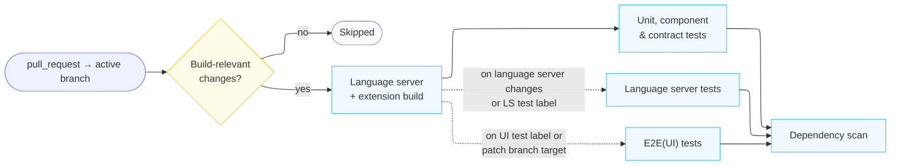
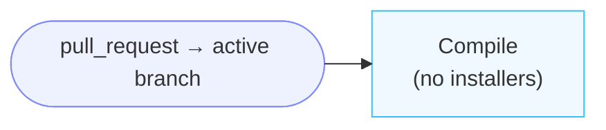
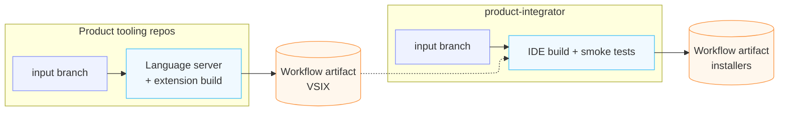
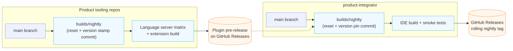
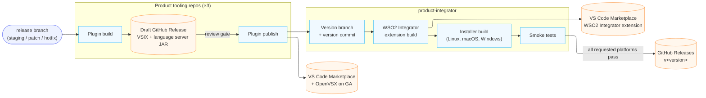

# CI/CD Pipelines

_Authors_: @NipunaRanasinghe \
_Reviewers_: @keizer619, @anupama-pathirage, @samithkavishke \
_Created_: 2026/08/10 \
_Updated_: 2026/08/12

This document describes the four GitHub Actions pipeline types used across all WSO2 Integrator repos:

- **PR pipelines:** run on pull requests to active branches; the configured gates must pass before merge. The stages differ per repo.
- **Custom build pipeline:** builds an IDE pack (or, in a plugin repo, a VSIX) on demand from any given branch.
- **Nightly pipeline:** runs daily. Each repo builds its own nightly from `main` and publishes it for downstream repos to continue.
- **Stable / GA pipeline:** a single three-stage flow (plugin build → plugin publish → IDE release) for both pre-release and GA releases; a pre-release flag controls the Marketplace channel and the artifact destinations.

## Pull Request Pipelines

PR pipelines run on every non-draft pull request targeting an active branch (`main`, patch branches, staging branches, hotfix branches) and must pass before a merge is permitted. 

**Product tooling repos** build the full chain and scan dependencies. Change detection runs first, so a pull request touching nothing build-relevant skips the build entirely.

The heavier suites are selective rather than unconditional, and each has its own trigger:

- **Unit, component, and contract tests** run with every build.
- **Language server tests** run when language server paths changed, or when the pull request carries the `Checks/Run LS Tests` label.
- **UI end-to-end tests** run when the pull request carries the `Checks/Run Ballerina UI Tests` label, or when it targets a patch branch.

**Product distribution repo** compiles the WSO2 Integrator extension, without building installers.

## Custom IDE Build Pipeline

Triggered manually to build from the branch it is dispatched on, for testing unmerged changes or a feature that spans multiple repos. In every repo, versions are timestamped for that run only, nothing is committed to any branch, and nothing is published to GitHub Releases or the Marketplace — the result is a workflow artifact.

Each repo's custom build stands alone: a plugin repo produces a timestamped pre-release VSIX, and `product-integrator` produces a complete IDE pack. The IDE build does not trigger the plugin builds. Inputs select whether the Ballerina and MI extensions are taken from their pinned builds or from the Marketplace, and every other component comes from the pinned component versions. To test unmerged plugin changes in a full IDE, run the plugin repo's custom build first and supply the resulting VSIX to the IDE build.

## Nightly Pipeline

Runs automatically on a daily schedule. Each repo runs its own nightly independently. The product distribution repo does not trigger plugin builds — it pins whatever nightly artifacts the plugin repos have already published.

Nightlies build from `main`, and switch to the release staging branch for as long as one exists, so that during a release window the nightly exercises the branch the release will be cut from. See [Branching Strategy](branching-strategy.md#release-staging-branch-stagingrelease-version).

Both repo types follow the same shape: reset a dedicated `builds/nightly` branch from the source branch, commit the versions for that night onto it, and build that commit. The diff between the source branch and the build branch is therefore exactly the version commit, so every nightly is reproducible from a single commit.

**Stage 1 — Plugin nightlies:** Each plugin repo runs its own nightly on its own schedule, stamping a timestamped pre-release version onto its build branch and publishing the resulting VSIX to its GitHub Releases. The plugin language server matrix is also where Windows coverage runs; the pull request build does not cover it. Coverage is uneven today: `ballerina-vscode` publishes a rolling `nightly` release, `mi-vscode` publishes timestamped pre-releases from its daily build, and `si-vscode` has no nightly pipeline at all.

**Stage 2 — Pin the component versions:** `product-integrator` does not trigger any of the above. It pins every dependent component to the newest nightly that repo publishes, falling back to that repo's newest GA release when it publishes none — which is what happens for `si-vscode` today. The product and extension versions are stamped alongside those pins in the same commit.

**Stage 3 — IDE build:** That commit is built for Linux, macOS, and Windows, smoke tests run, and on success the rolling `nightly` GitHub Release is replaced. The build branch (`builds/nightly`) and the published tag (`nightly`) are named differently on purpose: the tag is what external consumers pin their download URLs to, and using one name for both would leave the ref ambiguous.

## Release Pipelines

A release is one flow spanning all four repos, run once for each pre-release (alpha, beta, RC) and once for GA. A pre-release flag on each workflow controls the Marketplace channel and whether the artifacts are published as pre-releases. Every stage is dispatched manually by the release manager.

**Stage 1 — Plugin build:** The release manager triggers the build workflow in each of the three plugin repos (`ballerina-vscode`, `mi-vscode`, `si-vscode`) from the branch the release is cut from — the `staging/<release-version>` branch for feature releases, the `<major>.<minor>.x` patch branch for patch releases, or the hotfix branch for hotfixes. Each builds its VSIX and creates a draft GitHub Release carrying the VSIX and the language server JAR. The draft can be downloaded for internal verification (e.g. the fix author testing a hotfix locally) before Stage 2 publishes it.

**Stage 2 — Plugin publish:** After reviewing the draft, the release manager triggers each repo's publish workflow, which takes the Stage 1 run as its input and pushes that exact VSIX. The pre-release flag controls the destination:

- **Pre-release:** VS Code Marketplace pre-release channel
- **GA:** VS Code Marketplace stable channel + OpenVSX Registry

**Stage 3 — IDE release:** The release manager triggers the release workflow in `product-integrator` with the release version and the pre-release flag. Unlike the plugin repos, this stage both builds and publishes: it creates a branch named after the version, commits the version onto it so the release is reproducible from a single commit, builds the WSO2 Integrator extension against the plugin versions published in Stage 2, assembles installers for Linux, macOS, and Windows, runs smoke tests, and publishes the `v<version>` GitHub Release. The WSO2 Integrator extension is not a separate plugin build — it is produced here.

The release is published only if every requested platform build and its smoke tests succeed. A failed smoke test leaves no tag and no release, so a partially built distribution can never reach a published version.

## Artifact Publishing Targets

| Component | Nightly | Custom Build | Pre-release | Stable/GA |
|---|---|---|---|---|
| Shared UI library | N/A (built from source via git submodules) | N/A (built from source via git submodules) | N/A (built from source via git submodules) | N/A (built from source via git submodules) |
| Language server | N/A (bundled in parent extension) | N/A (bundled in parent extension) | GitHub Releases (JAR alongside the VSIX) + Maven package | GitHub Releases (JAR alongside the VSIX) + Maven package |
| VS Code extension plugins (×3) | GitHub Releases (rolling `nightly` release, or timestamped pre-release, per plugin) | N/A (built per run, not published) | VS Code Marketplace (pre-release channel) | VS Code Marketplace (stable) + OpenVSX Registry |
| WSO2 Integrator extension | Compiled during IDE build (not published separately) | N/A (built per run, not published) | VS Code Marketplace (pre-release channel) | VS Code Marketplace (stable) + OpenVSX Registry |
| WSO2 Integrator IDE | GitHub Releases (rolling `nightly` tag) | Workflow artifact (custom build run) | Workflow artifact (IDE release) | GitHub Releases (stable tag) |
