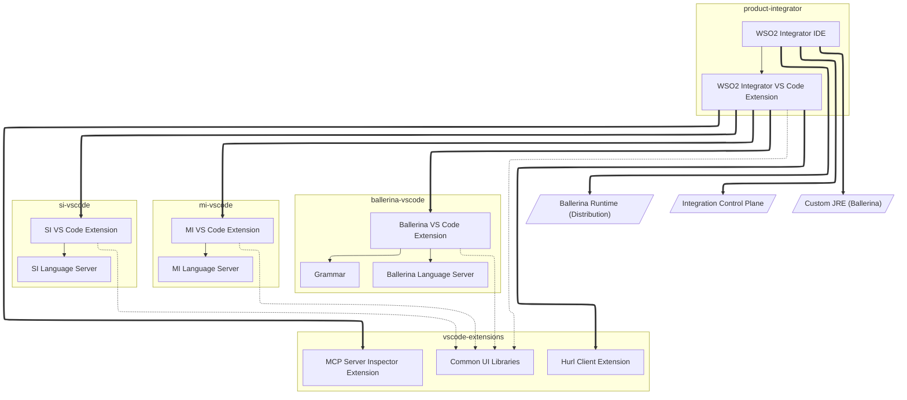

# Component Architecture

_Authors_: @NipunaRanasinghe \
_Reviewers_: @isudana, @anupama-pathirage, @keizer619 \
_Created_: 2026/08/10 \
_Updated_: 2026/08/10

This document defines the component architecture of the WSO2 Integrator tooling: the main components, their responsibilities, and their dependencies. It serves as a reference for understanding the repo structure, the build process, and the impact of changes across repos.

## Component Overview

The WSO2 Integrator tooling is organized into three layers, each represented by one or more GitHub repositories. The layers separate shared code, product-specific tooling, and the final distribution.

| Layer | Repo(s) | Description |
|---|---|---|
| **Shared Libraries and Extensions** | [vscode-extensions](https://github.com/wso2/vscode-extensions) | Shared UI libraries consumed by all product tooling repos, and helper VS Code extensions consumed by the product distribution layer |
| **Product tooling** | [ballerina-vscode](https://github.com/wso2/ballerina-vscode/), [mi-vscode](https://github.com/wso2/mi-vscode), [si-vscode](https://github.com/siddhi-io/siddhi-plugin-vscode/) | Product-specific tooling components. Each repo is a monorepo holding both the VS Code extension and its language server. |
| **Product distribution** | [product-integrator](https://github.com/wso2/product-integrator/) | Distribution packages for the integrated tooling |

Each repo contains one or more components. A component is a unit of functionality with a single responsibility, built and versioned as one piece. The table below lists the main components in each repo, along with a brief description of their responsibilities.

| Repo | Component | Description |
|---|---|---|
| [vscode-extensions](https://github.com/wso2/vscode-extensions) | **Common UI Libraries** | Shared TypeScript libraries: UI components, fonts and icons, AI utilities, UI test utilities, and platform core. Consumed by all product extensions via a git submodule; built from source in each consumer workspace. |
| | **Hurl Client Extension** | VS Code extension for Hurl client-based try-it capability. Published independently and consumed by `product-integrator` as a versioned built-in extension. |
| | **MCP Server Inspector Extension** | VS Code extension for inspecting MCP servers. Published independently and consumed by `product-integrator` as a versioned built-in extension. |
| [ballerina-vscode](https://github.com/wso2/ballerina-vscode/) | **Ballerina Language Server** | JVM service (Gradle) that provides language intelligence (completions, diagnostics, hover, and similar) for Ballerina source files. Bundled into the Ballerina VS Code Extension at build time. |
| | **Grammar** | TextMate grammar for Ballerina syntax highlighting. Ballerina maintains its own grammar because it is a custom language with no upstream grammar. Bundled into the Ballerina VS Code Extension. |
| | **Ballerina VS Code Extension** | TypeScript/Rush project that packages the language server, grammar, and UI libraries into a VSIX artifact. |
| [mi-vscode](https://github.com/wso2/mi-vscode) | **MI Language Server** | JVM service (Maven) providing language intelligence for Micro Integrator XML configurations. Bundled into the MI VS Code Extension. |
| | **MI VS Code Extension** | TypeScript/Rush project that packages the MI language server and UI libraries into a VSIX artifact. |
| [si-vscode](https://github.com/siddhi-io/siddhi-plugin-vscode/) | **SI Language Server** | JVM service (Gradle) providing language intelligence for Siddhi streaming queries. Bundled into the SI VS Code Extension. |
| | **SI VS Code Extension** | TypeScript/Rush project that packages the SI language server and UI libraries into a VSIX artifact. |
| [product-integrator](https://github.com/wso2/product-integrator/) | **WSO2 Integrator VS Code Extension** | Aggregates the three product VS Code extensions as versioned dependencies. Published to VS Code Marketplace. |
| | **WSO2 Integrator IDE** | Bundles the WSO2 Integrator VS Code Extension into a standalone IDE distribution. Published to GitHub Releases. |

## Dependency Diagram

The diagram below shows the build-time dependencies between components across the repos.

An arrow from A to B means A depends on B. The arrow style indicates the dependency type:

- **Thick arrow** — A declares B as a versioned dependency (a published artifact pinned by version)
- **Solid arrow** — A bundles B into its artifact (built within the same build pipeline, e.g. a language server JAR packaged into its extension's VSIX)
- **Dashed arrow** — A builds B from source via a git submodule (the shared UI libraries packages)

## Build Implications

The dependency relationships above determine the build order: each product tooling repo must produce its VSIX artifact before `product-integrator` can assemble the final distribution. Within each product tooling repo, two things must happen first:

1. **Shared UI libraries built from source:** Each consumer repo includes `vscode-extensions` as a git submodule. The shared libraries packages are built from source inside the consumer workspace before any extension package that depends on them. There is no independent libraries release. To adopt library changes, consumers move their submodule pointer forward and rebuild.

2. **Language server built before extension packaging:** Each tooling repo builds its language server first, producing a JAR. The VS Code extension then packages that JAR into the VSIX artifact.

Once each product tooling repo has produced its VSIX:

3. **`product-integrator` consumes pinned extension versions:** The `product-integrator` repo does not build the product extensions from source. The product extensions from `ballerina-vscode`, `mi-vscode`, and `si-vscode`, and the standalone extensions from `vscode-extensions` (`hurl-client`, `mcp-server-inspector`), are all consumed as versioned dependencies tracked in a version properties file. The WSO2 Integrator IDE bundles all of them. 
